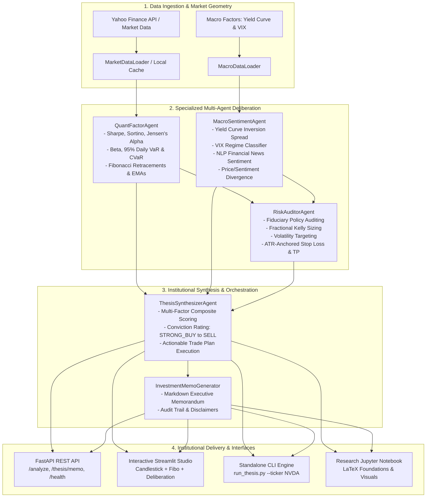

# 🏛️ QuantAgent-Alpha: Institutional Multi-Agent Quantitative Intelligence & Investment Thesis Engine

[](https://github.com/gsbriel0019/quantagent-alpha/actions/workflows/ci.yml)
[](https://www.python.org/)
[](https://fastapi.tiangolo.com)
[](https://streamlit.io)
[](https://pytest.org)
[](https://opensource.org/licenses/MIT)
[](https://github.com/psf/black)

> **Architected & Engineered by:** **Gabriel Proaño** ([@gsbriel0019](https://github.com/gsbriel0019))  
> **Repository:** [`https://github.com/gsbriel0019/quantagent-alpha`](https://github.com/gsbriel0019/quantagent-alpha)

---

## 🌟 Executive Overview

**QuantAgent-Alpha** is an institutional-grade, autonomous multi-agent quantitative finance and investment intelligence platform. Designed to bridge the gap between high-frequency quantitative factor modeling and macroeconomic qualitative sentiment, the system coordinates specialized AI agents that debate, cross-examine, audit, and synthesize institutional **Investment Memorandums** with strict fiduciary risk governance.

Traditional equity research relies on fragmented spreadsheets or generic sentiment indicators. **QuantAgent-Alpha** introduces an end-to-end autonomous decision pipeline:
1. **Mathematical Factor Modeling:** Rolling Sharpe, Sortino, Calmar, Jensen's Alpha, Beta, and tail-risk metrics (Value-at-Risk 95% and Conditional VaR / Expected Shortfall).
2. **Market Geometry & Fibonacci Harmonics:** Automated Swing High/Low detection and Golden Ratio ($0.618$) retracement support/resistance clusters.
3. **Macroeconomic Regime & NLP Sentiment:** Treasury yield curve slope ($10\text{Y} - 2\text{Y}$), VIX volatility regime classification, and financial news polarity scoring with divergence detection.
4. **Fiduciary Risk Governance & Position Sizing:** Institutional mandate auditing, Volatility Targeting, and Half-Kelly Criterion risk budgeting.
5. **Multi-Channel Delivery:** Interactive **Streamlit Studio**, production **FastAPI REST API**, standalone **CLI runner**, and research **Jupyter Notebook**.

---

## 🏗️ Multi-Agent Architecture



---

## 🤖 The Autonomous Agent Ecosystem

### 1. `QuantFactorAgent` (Quantitative Modeling & Harmonics)
- Computes annualized log-returns, realized volatility, and risk-adjusted ratios against the market benchmark ($S\&P\ 500$).
- Estimates downside risk using semi-variance for the **Sortino Ratio** and peak-to-trough drawdowns for the **Calmar Ratio**.
- Implements non-parametric daily **Value-at-Risk ($VaR_{0.95}$)** and **Conditional Value-at-Risk ($CVaR_{0.95}$ / Expected Shortfall)**.
- Maps Fibonacci retracement geometry ($23.6\%, 38.2\%, 50.0\%, 61.8\%, 78.6\%$) based on rolling swing extrema.

### 2. `MacroSentimentAgent` (Macroeconomic Regime & NLP Sentiment)
- Classifies macroeconomic cycle regime: `EXPANSION_RISK_ON`, `LATE_CYCLE`, `CONTRACTION_RISK_OFF`, or `RECOVERY`.
- Tracks the US 10-Year vs 2-Year Treasury spread to identify yield curve inversion hazards.
- Analyzes financial news headlines using a finance-specific lexicon to score net sentiment between $-1.0$ (extreme bearish) and $+1.0$ (extreme bullish).
- Detects **Bullish Divergence** (bearish price action against bullish fundamental sentiment) and **Bearish Divergence** (bullish price action against deteriorating fundamentals).

### 3. `RiskAuditorAgent` (Fiduciary Governance & Capital Sizing)
- Enforces institutional mandate checks:
  - $\text{Sharpe Ratio} \ge 0.75$
  - $\text{Max Drawdown} \le 28.0\%$
  - $\text{Daily } 95\% \text{ VaR} \le 4.5\%$
- Calculates optimal position size via **Volatility Targeting** and the **Fractional Kelly Criterion**.
- Synthesizes risk boundaries: dynamic ATR-anchored Stop Loss and multi-stage Take Profit targets ($TP1$, $TP2$) ensuring a minimum $1.5 : 1$ risk-to-reward ratio.
- Issues formal audit verdict: `APPROVED`, `APPROVED_WITH_CONDITIONS`, or `REJECTED`.

### 4. `ThesisSynthesizerAgent` (Lead Strategist & Executive Orchestrator)
- Combines factor scores ($45\%$ Quantitative, $25\%$ Macro/Sentiment, $30\%$ Risk Governance).
- Issues conviction rating: `STRONG_BUY`, `BUY`, `NEUTRAL`, `REDUCE`, or `SELL`.
- Produces complete executive memorandum ready for investment committees.

---

## 📐 Mathematical Foundations

### 1. Risk-Adjusted Ratios & Jensen's Alpha
$$\text{Sharpe} = \frac{\mu_{\text{ann}} - R_f}{\sigma_{\text{ann}}}, \quad \text{Sortino} = \frac{\mu_{\text{ann}} - R_f}{\sigma_{\text{downside}} \cdot \sqrt{252}}$$

$$\alpha_{\text{ann}} = (\mu_{\text{ann}} - R_f) - \beta \cdot (\mu_{m,\text{ann}} - R_f), \quad \text{where } \beta = \frac{\text{Cov}(r_i, r_m)}{\text{Var}(r_m)}$$

### 2. Tail-Risk Metrics (Value-at-Risk & Expected Shortfall)
$$\text{VaR}_{\alpha} = -F_r^{-1}(1 - \alpha), \quad \text{CVaR}_{\alpha} = -\mathbb{E}\left[r_t \mid r_t \le -\text{VaR}_{\alpha}\right]$$

### 3. Fibonacci Harmonics & Golden Pocket
Derived from the golden ratio $\phi = \frac{1 + \sqrt{5}}{2} \approx 1.6180339887$:
$$\text{Golden Pocket} = \text{Swing High} - 0.618 \cdot (\text{Swing High} - \text{Swing Low})$$

### 4. Position Sizing: Half-Kelly & Volatility Budgeting
$$f^* = \frac{p \cdot b - (1 - p)}{b} \times 0.5, \quad w_{\text{vol}} = \min\left(0.20, \frac{\sigma_{\text{target}}}{\sigma_{\text{asset}}}\right)$$
where $p$ is the empirical win rate, $b$ is the profit factor, and $\sigma_{\text{target}} = 18.0\%$.

---

## 📂 Project Repository Structure

```
d:\Proyectos Antigravity\Proyectos github\
├── .github/
│   └── workflows/
│       └── ci.yml                 # GitHub Actions CI matrix (Python 3.10 & 3.11)
├── app/
│   ├── __init__.py
│   ├── api.py                     # FastAPI REST API with OpenAPI documentation
│   └── streamlit_app.py           # Interactive Multi-Agent Investment Studio
├── config/
│   ├── __init__.py
│   └── settings.yaml              # Risk thresholds, lookbacks, and parameters
├── notebooks/
│   └── 01_quant_agent_alpha_foundations.ipynb # LaTeX research notebook
├── src/
│   ├── __init__.py
│   ├── agents/
│   │   ├── __init__.py
│   │   ├── base.py                # Abstract BaseAgent with telemetry
│   │   ├── quant_factor_agent.py  # Statistical, factor, and harmonic modeling
│   │   ├── macro_sentiment_agent.py # Macro regime & NLP sentiment agent
│   │   ├── risk_auditor_agent.py  # Institutional risk governance auditor
│   │   └── thesis_synthesizer.py  # Multi-agent orchestrator & thesis engine
│   ├── data/
│   │   ├── __init__.py
│   │   ├── market_data.py         # Yahoo Finance loader with caching & simulation
│   │   └── macro_data.py          # Yield curve, VIX, and news sentiment loader
│   ├── indicators/
│   │   ├── __init__.py
│   │   ├── technical.py           # EMA, RSI, MACD, Bollinger, ATR engine
│   │   └── fibonacci.py           # Fibonacci retracements & support/resistance
│   ├── models/
│   │   ├── __init__.py
│   │   └── schemas.py             # Strict Pydantic v2 data contracts
│   └── reporting/
│       ├── __init__.py
│       └── investment_memo.py     # Executive memorandum generator
├── tests/
│   ├── __init__.py
│   ├── test_api.py                # FastAPI endpoint integration tests
│   ├── test_fibonacci.py          # Harmonic level calculations
│   ├── test_macro_sentiment_agent.py # Macro regime and sentiment tests
│   ├── test_market_data.py        # Ingestion and synthetic cache tests
│   ├── test_quant_factor_agent.py # Factor statistics and tail-risk tests
│   ├── test_risk_auditor_agent.py # Risk mandate compliance tests
│   ├── test_technical_indicators.py # Technical indicators tests
│   └── test_thesis_synthesizer.py # End-to-end multi-agent orchestration tests
├── Dockerfile                     # Production container definition
├── docker-compose.yml             # Orchestration for API & Dashboard
├── LICENSE                        # MIT License
├── pyproject.toml                 # Packaging & pytest configuration
├── requirements.txt               # Pinned dependencies
├── run_thesis.py                  # Standalone CLI analysis runner
└── README.md                      # Institutional documentation
```

---

## ⚡ Quickstart Guide

### 1. Clone & Set Up Virtual Environment

```bash
git clone https://github.com/gsbriel0019/quantagent-alpha.git
cd quantagent-alpha

# Create and activate virtual environment
python -m venv venv
# Windows:
.\venv\Scripts\activate
# Linux/macOS:
source venv/bin/activate

# Install dependencies
pip install -r requirements.txt
```

### 2. Run Automated Pytest Suite (14 Tests, 88% Coverage)

```bash
pytest tests/ -v
```

Output:
```text
tests/test_api.py::test_api_root PASSED
tests/test_api.py::test_api_health PASSED
tests/test_api.py::test_api_macro PASSED
tests/test_api.py::test_api_analyze PASSED
tests/test_api.py::test_api_memo PASSED
tests/test_fibonacci.py::test_fibonacci_uptrend_levels PASSED
tests/test_macro_sentiment_agent.py::test_macro_sentiment_agent_execution PASSED
tests/test_market_data.py::test_market_data_synthetic_fallback PASSED
tests/test_market_data.py::test_market_data_fetch_pair PASSED
tests/test_quant_factor_agent.py::test_quant_factor_agent_metrics PASSED
tests/test_risk_auditor_agent.py::test_risk_auditor_approval PASSED
tests/test_technical_indicators.py::test_technical_indicators_computation PASSED
tests/test_technical_indicators.py::test_insufficient_data_error PASSED
tests/test_thesis_synthesizer.py::test_thesis_synthesizer_pipeline PASSED

---------- coverage: platform win32, python 3.10.5 -----------
Name                                  Stmts   Miss  Cover
TOTAL                                   653     76    88%
======================== 14 passed in 8.69s ========================
```

---

## 🖥️ Running the Platform

### Option A: Standalone CLI Analysis Runner

Generate an instant institutional quantitative analysis and export the executive memo:

```bash
python run_thesis.py --ticker NVDA --save-memo
```

```text
======================================================================
🏛️  QUANTAGENT-ALPHA: MULTI-AGENT QUANTITATIVE ENGINE
Author: Gabriel Proaño (@gsbriel0019)
Target Ticker: NVDA | Benchmark: ^GSPC | Horizon: 1y
======================================================================

📌 EXECUTIVE VERDICT: BUY (Confidence: 63.3%)
Current Price: $225.51 | Target (TP1): $229.81 (+1.91%)
Risk Audit Verdict: APPROVED_WITH_CONDITIONS | Max Allocation: 2.67%

[✓] Executive Memorandum saved to: QuantAgent_Alpha_Memo_NVDA.md
```

### Option B: Interactive Streamlit Studio

Launch the comprehensive multi-tab trading dashboard:

```bash
streamlit run app/streamlit_app.py
```
*Opens at: `http://localhost:8501`*

Features:
- **Candlestick & Fibonacci Charts:** Interactive Plotly charting with EMA 20/50, Fibonacci retracement lines, and RSI subplots.
- **Multi-Agent Deliberation Cards:** Live logs showing quantitative factor findings, macro regime warnings, and risk audit badges.
- **Institutional Risk Table:** Direct comparison of asset metrics vs S&P 500 benchmark.
- **One-Click Memorandum Export:** Download formal Markdown memos.

### Option C: FastAPI REST API

Start the high-performance API server:

```bash
uvicorn app.api:app --host 0.0.0.0 --port 8000 --reload
```
*Interactive Swagger UI Documentation: `http://localhost:8000/docs`*

Endpoints:
- `GET /health`: Agent system health and active modules.
- `GET /analyze/{ticker}`: Full multi-agent deliberation and `InvestmentThesis` model.
- `GET /thesis/memo/{ticker}`: Formatted Markdown Executive Investment Memorandum.
- `GET /macro/regime`: Real-time yield curve slope, 10Y Treasury yield, and VIX level.

### Option D: Docker & Docker Compose

Deploy the complete ecosystem in containers:

```bash
docker-compose up --build
```

---

## 👤 Author & Fiduciary Disclaimer

**Gabriel Proaño**  
GitHub: [@gsbriel0019](https://github.com/gsbriel0019)  
Email: `162929814+gsbriel0019@users.noreply.github.com`

*Disclaimer: QuantAgent-Alpha is designed for research, algorithmic prototyping, and educational quantitative finance purposes. Past performance and quantitative factor models do not guarantee future market returns. Capital at risk.*
